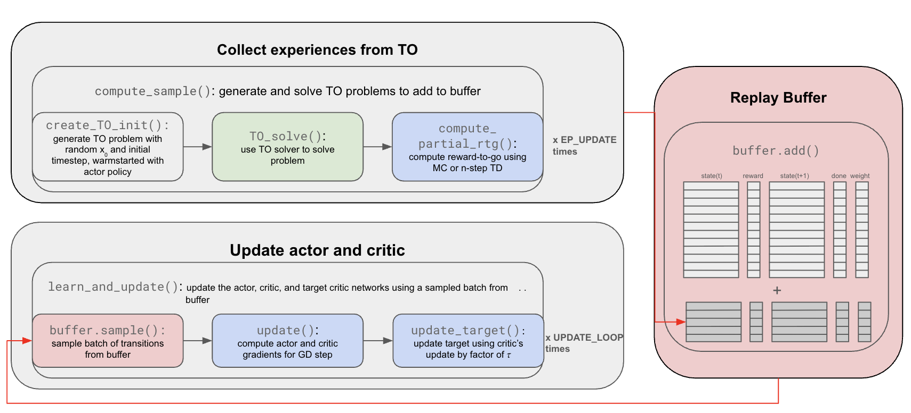

# GATO-RL
Adaptation/simplification of [cacto](https://github.com/gianluigigrandesso/cacto) in PyTorch and alt. trajectory optimizer software. 

To understand the codebase, we recommend starting at ```src/main.py```. The diagram below helps explain the framework. First, we collect experiences using the TO solver. We solve ```EP_UPDATE``` number of TO problems, which have random initialization and warm-started using the actor policy. We compute the partial reward-to-go associated with each state of each TO problem, which we call "transitions", which are tuples $(s_t, a_t, r_t, s_{t+n}, d_t)$:

- $s_t$: state at time $t$
- $a_t$: action at time $t$
- $r_t$: partial reward-to-go at time $t$.
  - If Monte-Carlo, $r_t$ is the sum of future rewards until $T$, the end of the trajectory: $r_t = \sum_{k=t}^{T} R_k$.
  - If n-step Temporal Difference, $r_t$ is the sum of the $n$ next steps' rewards: $r_t = \sum_{k=t}^{t+N-1} R_k$.
- $s_{t+n}$: state at time $t+n$
- $d_t$: done (if the reward-to-go is complete)

Then, there will be ```EP_UPDATE```$\times$```(avg. number of timesteps per problem)``` of transitions  stored in the buffer defined in ```ReplayBuffer.py```. Then, we perform ```UPDATE_LOOP``` iterations of updating the actor, critic, and target critic networks by sampling ```BATCH_SIZE``` number of transitions from the buffer. Here are how each of the networks are updated:

- Critic: loss is means-squared error between $V_\phi(s_t)$ and  $\hat{R}_t)$ where $\hat{R}_t$ is the full reward-to-go
- Actor: loss is the negative mean of Q-values $\frac{1}{S} \sum_{i=1}^{S} Q(s_i, \pi(s_i))$
- Target critic: Parameters $\phi'$ updated via: $\phi' \leftarrow \tau \phi + (1 - \tau) \phi'$ with $\tau \in (0, 1)$ controlling the update rate (e.g., $\tau = 0.005$).




# Usage
1. Create a configuration file for your system. This file includes dynamics functions, reward functions, and hyperparameters for your problem. See ```iiwa_conf.py``` for reference, or feel free to use existing files in the ```/confs``` folder.
2. Run ```src/main.py```. This will perform episodes of TO and RL to train your model.
3. Test the trained network using the saved model, which will be in your defined path from your configuration file (```NNs_path```).
   
# Installation
```shell
python3 -m venv venv
source venv/bin/activate
pip install -r requirements.txt
